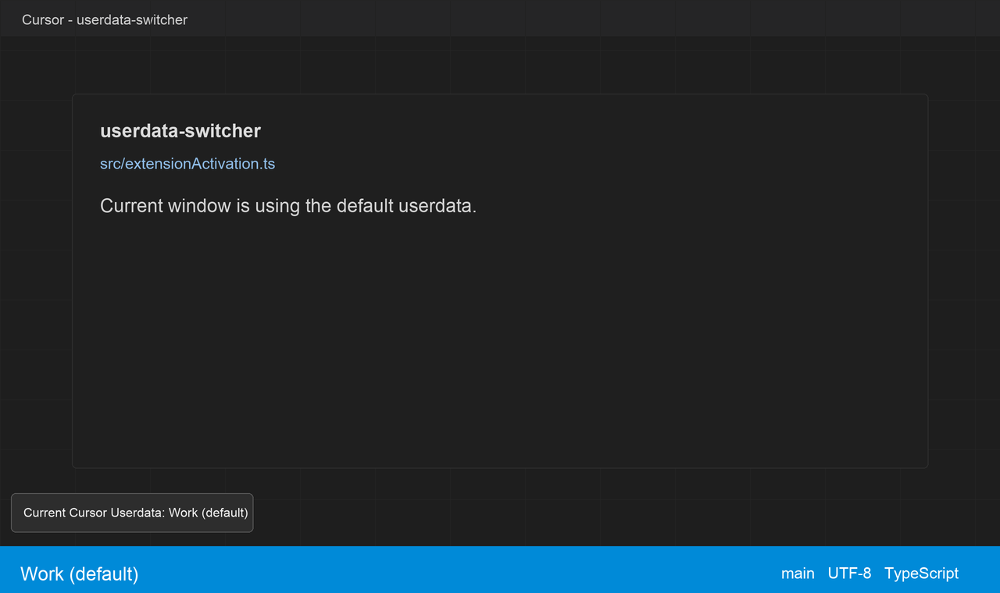
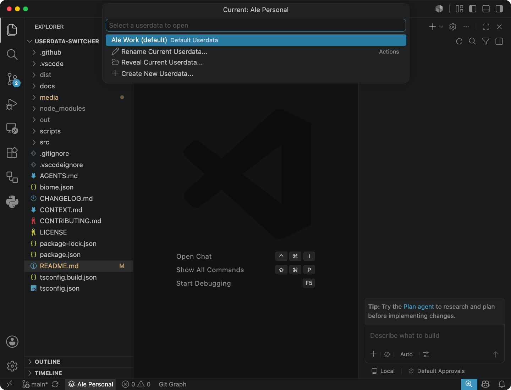
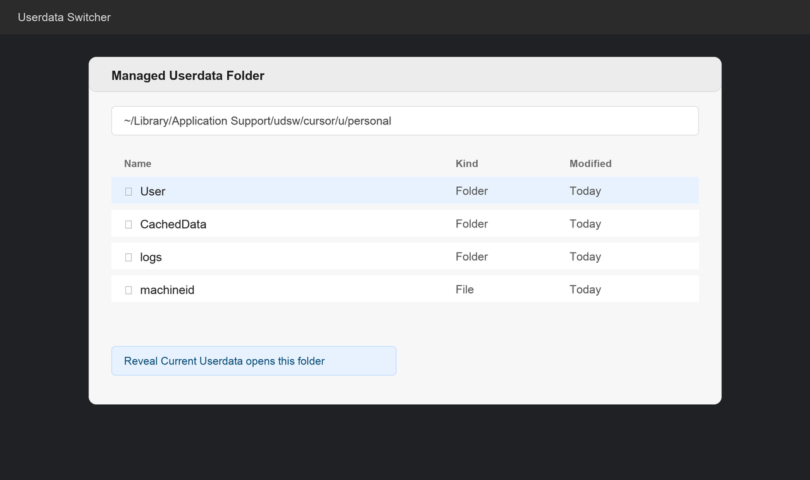
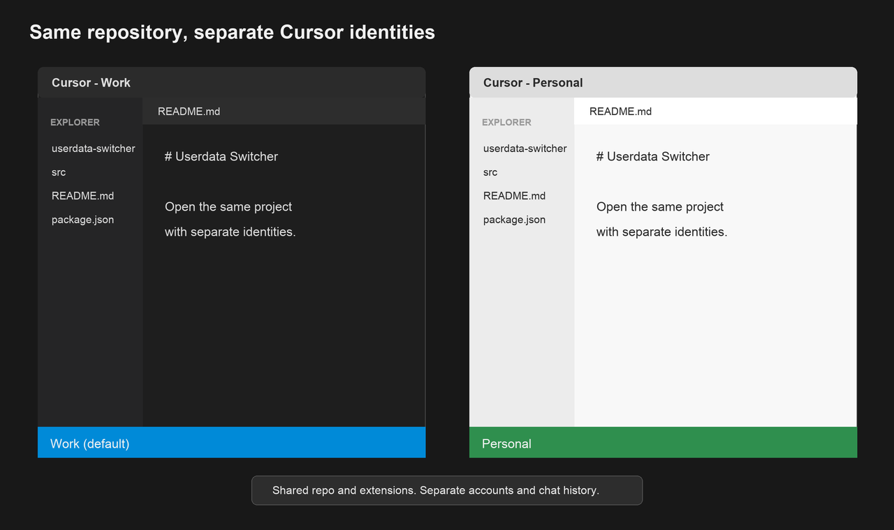
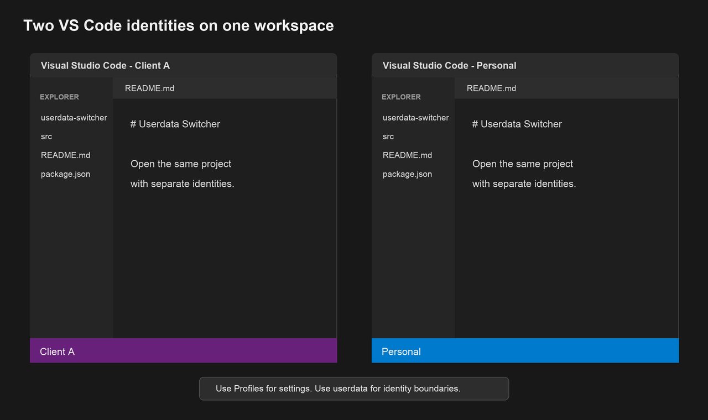

# Userdata Switcher

Open the same project in separate Cursor or VS Code identities — different
accounts, settings, and chat history — without copying the repo or touching auth
storage.

### Multiple Cursor AI Accounts made easy and clean

This is currently the **only** clean way to support **multiple Cursor AI accounts** on the same machine, without goingh through the hassle of logging in and out. You can even have all of them open together!

## Install

### Visual Studio Marketplace

Not published to the Marketplace yet. Use **Install from VSIX** below for now.

### Install from VSIX

1. Obtain `userdata-switcher-<version>.vsix` — build locally with
   `npm run package:vsix`, or download from
   [GitHub Releases](https://github.com/domoarigatomrburato/userdata-switcher/releases)
   when a release is published.
2. Open the Extensions view in your editor.
3. Open the view menu (`⋯` on the Extensions toolbar) and choose **Install from
   VSIX...**.
4. Select the file and reload when prompted.

Cursor users can install the VSIX the same way.

### Supported editors

- Visual Studio Code
- Visual Studio Code Insiders
- Cursor

Unsupported VS Code-family forks are not guessed automatically.

This extension runs in the **local desktop UI**. It does not activate in Remote
SSH, WSL, or other remote extension hosts.

## Quick start

1. Look at the **status bar** to see which userdata this window is using.
2. Click it, or run **`Userdata Switcher: Open With Userdata`**.
3. Pick another userdata to open, or use the actions at the bottom of the menu:
   create, rename, or reveal the current folder.
4. The first time you open a new managed userdata, sign in to the account you
   want for that context.

<!-- Screenshot: status bar item showing current userdata label (e.g. Default (default) or Personal) -->
<!-- File: media/screenshot-status-bar.png -->

<!-- Screenshot: Open With Userdata menu with Current label, userdata list, and Actions -->

The default userdata is the normal editor launch with no `--user-data-dir`. Its
label starts as `Default (default)` until you rename it. Managed userdatas are
launched with `--user-data-dir`.

If the status bar shows **Unmanaged**, this window is using a userdata root the
extension does not recognize — for example one you opened manually with
`--user-data-dir`. You can still open other userdatas and reveal the current
folder, but rename is not available until the window matches a known entry.

### Commands

- `Userdata Switcher: Open With Userdata`
- `Userdata Switcher: Create Userdata`
- `Userdata Switcher: Rename Current Userdata`
- `Userdata Switcher: Show Current Userdata`
- `Userdata Switcher: Reveal Current Userdata`

<!-- Screenshot: Reveal Current Userdata opening the userdata folder in Finder / Explorer -->
<!-- File: media/screenshot-reveal-userdata.png -->

## When Profiles are not enough

VS Code and Cursor **Profiles** are great for switching settings, themes,
extensions, keybindings, and snippets inside one editor install.

They are **not** a separate editor identity. Profiles live inside a single
userdata root. They do not give you a separate product sign-in boundary on
their own.

Use **Profiles** when you only need different editor configuration inside one
sign-in.

Use **Userdata Switcher** when you need any of the following:

| You need… | Profiles | Userdata Switcher |
| --- | --- | --- |
| Different themes or settings per context | Yes | Yes |
| Different extension *sets* per context | Yes | No — extensions are shared (see below) |
| Different GitHub Copilot account in VS Code (per workspace/profile) | Yes, natively | Usually unnecessary |
| Different **Cursor** AI account or subscription | No | Yes |
| **Work and Personal open at the same time** on the same repo | No | Yes |
| Separate sign-in, chat history, caches, and editor settings | No | Yes |
| Hard isolation between client or personal editor environments | No | Yes |

### Cursor

Cursor does not currently offer a native way to keep different signed-in Cursor
accounts per workspace or profile. The usual workarounds are signing out and
back in, or launching separate instances with `--user-data-dir`.

Profiles in Cursor can separate themes and settings, but they do **not**
change which Cursor account or subscription the editor is using.

That is the main gap this extension targets.

<!-- Screenshot: two Cursor windows on the same repo — Work (default) and Personal, different themes optional -->
<!-- File: media/screenshot-cursor-work-personal.png -->

### VS Code

For **GitHub Copilot**, start with the built-in flow: Accounts → **Manage
Extension Account Preferences** → choose the GitHub account for Copilot in this
workspace or profile.

Reach for Userdata Switcher when you need more than that — for example two
full editor identities running side by side, or isolation that goes beyond
what Profiles and per-extension account preferences provide.

<!-- Screenshot (optional): two VS Code windows side by side when Profiles are not enough -->
<!-- File: media/screenshot-vscode-dual-identities.png -->

## Why this approach is clean

The extension launches supported editors with isolated userdata roots using the
editor's own `--user-data-dir` mechanism.

It does not copy tokens, edit SQLite databases, or rewrite sign-in state. Each
userdata is a normal editor launch in its own storage boundary.

### Shared extensions by design

Managed userdatas isolate **identity** — sign-in, settings, chat history, and
caches — while keeping **extensions in one place**.

When you open a managed userdata, the launcher passes both `--user-data-dir`
(for the isolated context) and `--extensions-dir` (pointing at your editor's
normal extension install, such as `~/.cursor/extensions` or
`~/.vscode/extensions`).

That is intentional, and it is a practical win:

- **Install once, use everywhere.** Install Userdata Switcher — or any other
  extension — once. Every managed userdata sees the same tools without
  re-downloading or re-enabling them.
- **Less disk and update churn.** You are not maintaining duplicate extension
  trees for Work, Personal, and Client A.
- **The split matches what usually matters.** Most people want the same
  extensions in every context, but a different account, theme, or settings
  profile. Userdata Switcher separates the boundary that Profiles cannot.

You still get per-userdata themes and settings because those live in the
userdata root. If you need different extension *sets* within one sign-in,
Profiles remain the right tool.

## Where data is stored

Managed userdata is stored separately per supported editor host (`cursor`,
`vscode`, or `vscode-insiders`):

- macOS: `~/Library/Application Support/udsw/<host>`
- Linux: `$XDG_DATA_HOME/udsw/<host>` or `~/.local/share/udsw/<host>`
- Windows: `%LOCALAPPDATA%\udsw\<host>`

Different hosts do not share registries or managed userdata directories.

## What this is not

This extension does not modify credentials, sessions, tokens, or product
sign-ins. It does not replace VS Code Profiles, and it does not integrate with
sidebar sign-in controls.

## Diagnostics

If a launch fails, open the editor Output panel and select `Userdata Switcher`.
The channel records the detected host, storage paths, and launch diagnostics.

Common failures surfaced there:

- **Editor CLI not found** — the extension could not locate the bundled or
  `PATH` CLI for this host (`cursor`, `code`, or `code-insiders`).
- **Managed path too long (macOS)** — the userdata path exceeds the Unix socket
  path limit. Try a shorter label or a shorter home directory path.

## Notes

- Opening a managed userdata spawns the editor CLI and may open a new window or
  focus an existing one for that userdata, depending on the editor.
- From a **multi-root** window with no saved `.code-workspace` file, the launch
  opens the editor without a workspace path. Save the workspace first, or open
  from a single-folder window, if you need the project loaded automatically.
- Chat history, tabs, and other state from one userdata context do not carry
  over to another.

## Feedback

Report bugs and feature requests on
[GitHub Issues](https://github.com/domoarigatomrburato/userdata-switcher/issues).
