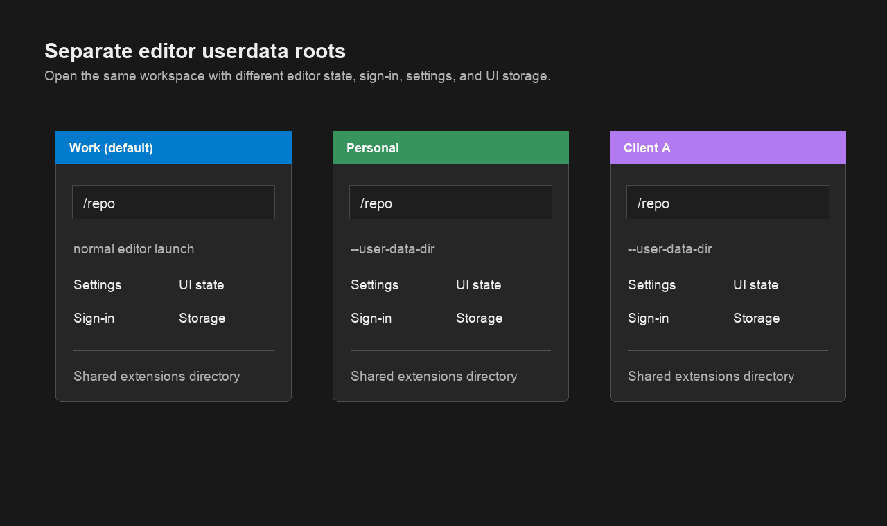

# Userdata Switcher

Open VS Code-family editors with named, isolated userdata roots.

## What It Does

Userdata Switcher lets you open the current workspace in another editor
userdata root, such as `Work`, `Personal`, or `Client A`.

Each userdata root keeps its own editor state, settings, UI storage, and
sign-in context. Managed userdata roots still use the normal shared extensions
directory for the host editor.

## Supported Editors

- Visual Studio Code
- Visual Studio Code Insiders
- Cursor

Unsupported VS Code-family forks are not guessed automatically. Each supported
host needs known command-line and data-directory behavior.

## How To Use

1. Install the extension.
2. Look at the status bar item to see the current userdata for this window.
3. Click the status bar item or run `Userdata Switcher: Open With Userdata`.
4. Create a new userdata, rename the current userdata label, or open another
   known userdata.

The default userdata is the normal editor launch with no `--user-data-dir`
argument. Managed userdata roots are launched with `--user-data-dir`.

## What This Is Not

This extension does not modify credentials, sessions, tokens, or product
sign-ins. It does not use VS Code Profiles, and it does not integrate with
sidebar sign-in controls.

VS Code Profiles manage editor configuration such as settings, keybindings, and
extension configuration. Userdata Switcher manages the larger editor userdata
root boundary used by the editor process.

## Commands

- `Userdata Switcher: Open With Userdata`
- `Userdata Switcher: Create Userdata`
- `Userdata Switcher: Rename Current Userdata`
- `Userdata Switcher: Show Current Userdata`

## Notes

Opening a managed userdata may start or focus another editor window. Existing
chat/editor tabs from another userdata context may not be valid in the newly
opened context; open a new chat/tab when needed.

Managed userdata directories are stored under the platform's normal application
data location for the host editor and this extension.
