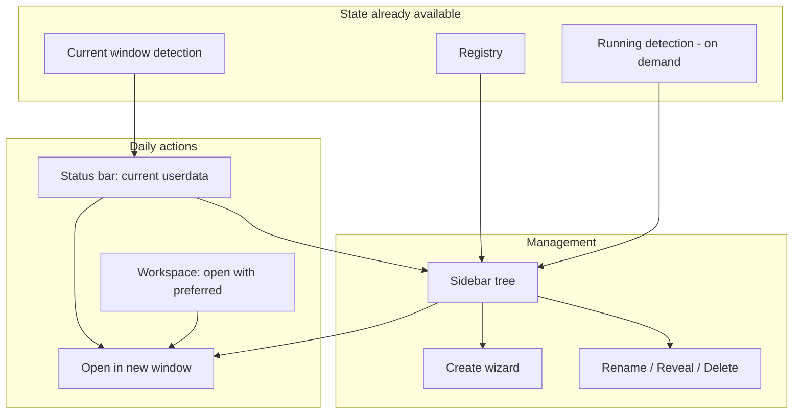

# UX Evolution Proposal

Status: Draft for discussion. No implementation committed.
Scope: Evolve the Cursor/VS Code UI for the **current** feature set. No new
capabilities, no settings sync (explicitly out of scope — see "Decisions").

This document integrates two independent UX analyses and reconciles them against
the actual codebase plumbing. Where a suggestion is technically infeasible or
architecturally wrong for this project, it is corrected here rather than copied.

---

## 1. Where the UI is today

The entire surface is **one status bar item -> one flat Quick Pick**, behind a
clean `UserdataSwitcherUi` seam (`src/userdataSwitcherApp.ts`).

- **Status bar** (`src/labels.ts`): `$(layers) Work (default)` (left, priority
  100). Tooltip: `Current Cursor Userdata: <label>`. Click runs
  `userdataSwitcher.openWithUserdata`.
- **Open With Userdata Quick Pick** (`src/menu.ts`): a flat list that mixes two
  different jobs — *navigation* (other userdatas to open) and *management*
  (`Rename current`, `Reveal current`, `Create`, `Delete`) under an "Actions"
  separator.
- **Sub-flows** are sequential modals: create = input box -> **modal
  information message** for seed/empty (`pickUserdataCreationMode`) -> launch;
  delete = its own Quick Pick -> warning confirm.
- **Commands** (`package.json`): six commands (open, create, rename, show,
  reveal, delete), palette-only, no icons or keybindings.

What the MVP gets *right* and must be preserved: the interaction model matches
the domain. **Userdata is a process boundary, not an in-window switch**
(`CONTEXT.md`: "Userdata Boundary"). The status bar answers "which identity is
this window?" and the picker launches parallel windows. This must not regress
into looking like a profile switcher.

---

## 2. Core UX tensions

1. **One flat Quick Pick conflates "go somewhere" with "manage something."**
   Opening `Personal` (the daily 90% action) costs the same as deleting a
   userdata (rare, destructive). Dangerous actions sit next to safe ones.
2. **Management is current-window-centric, which is backwards for this product.**
   You can only *rename* the userdata you are currently in, and *reveal* the
   current one. The headline use case is several windows in parallel, so the
   userdata you most want to manage (e.g. "Client A", open in another window) is
   the one you cannot act on without first switching into it.
3. **No window identity at a glance.** With three windows open
   (Work / Personal / Client A), only the small status bar text distinguishes
   them. This is the #1 daily friction for the actual use case.
4. **No live state.** Running-instance detection already exists (used for
   deletion) but is never surfaced in the menu.
5. **Onboarding is invisible.** A `$(layers)` icon with no welcome state.
   First-run discovery relies entirely on the README.
6. **"Open With" reads like "switch."** Users may expect the current window to
   change; the extension spawns a new process instead.

---

## 3. Design principles (keep these)

1. **This window != other windows** — always show the current context first.
2. **Open = new window** — never imply hot-swap of the current window.
3. **Parallel by default** — optimize for "Work and Personal side by side."
4. **Progressive disclosure** — launch is one click; admin is one level deeper.
5. **Running state is pull, not push** — surface it when the user looks, never
   via a background poller (see Section 6, constraint C3).
6. **Native, zero-friction surfaces only** — status bar, Quick Pick, tree view.
   No webview dashboards.

---

## 4. Decisions already made in discussion

- **Settings sync is OUT of scope.** Drift after the one-time copy
  (`src/preferences.ts` seeds `User/settings.json`, `User/keybindings.json`,
  `User/snippets` once) stays the behavior. Continuous or selective sync was
  considered and rejected as too complex and as fighting VS Code's
  single-owner `settings.json` model. Theme drift is arguably a *feature*
  (window identity), not a bug.
- **No webview.** A stepped Quick Pick covers every wizard need.
- **No in-window "switch userdata."** Violates the boundary model.

---

## 5. Recommended evolution (phased)

Phases are ordered by leverage-to-effort. The project's stated appetite is
MVP-minimal, so Phase 1 is the committed near-term target; later phases are
deferred until management actually hurts.

### Phase 1 — Reshape the picker (low effort, high impact) — DO NOW

Fix the mental model without adding any new surface.

```
+- Open with Userdata ------------------------------+
| Current window: Work (default)                    |
+---------------------------------------------------+
| Personal          running                         |
| Client A          idle                            |
+---------------------------------------------------+
| $(add)  Create new userdata...                    |
| $(gear) Manage userdatas...                       |
+---------------------------------------------------+
```

Changes:
- **Pin current as a header row**, described as "this window"; do not list it as
  a launch target. (`buildOpenWithUserdataMenuItems` already filters current for
  managed; formalize it.)
- **Show running/idle per row**, computed **on menu open** (not polled), via
  `isUserdataEditorInstanceRunning`. Show `running` or `idle` only — see
  constraint C1 (no window counts).
- **Move admin behind "Manage userdatas..."** -> a second Quick Pick where
  rename / reveal / delete can target **any** userdata (fixes tension #2),
  with destructive actions one level deeper (principle 4).
- **Clarify copy**: keep the command id `userdataSwitcher.openWithUserdata`
  (renaming it breaks keybindings/muscle memory), but adjust labels/tooltip to
  teach "opens another window."

Touch points: `src/menu.ts` (grouping, current-as-header, running metadata),
`src/userdataSwitcherApp.ts` (orchestration of the "Manage" sub-pick), and the
`menu.test.ts` pattern for the item builders. Stays within the existing
`UserdataSwitcherUi` seam.

Also cheap and worth bundling:
- **Keybinding** for the open picker.
- **Launch-failure notification** with an "Open Output" action (the channel is
  already wired in `src/extension.ts`).

### Phase 2 — Sidebar "Userdatas" tree view (medium effort, best long-term home)

A `TreeDataProvider` is the honest fit: a list of entities with state, not a
settings panel. Per-item context menus are natively better than Quick Pick
buttons.

```
USERDATAS (Cursor)
  Work (default)     <- this window
  Personal           running
  Client A           idle
  [+] Create userdata
```

- Per-item context menu (`contributes.menus`): Open in new window · Reveal ·
  Rename · Delete.
- Title-bar actions: Create, Refresh running state (manual, see C3).
- `viewsWelcome` markdown for the empty state (addresses onboarding, tension #5):
  "No managed userdata yet — create one."
- Coexists with the status bar, which stays the compact "this window" mirror.

This is a real commitment (new contribution points, new UI maintenance). Build
it only when picker-based management becomes the bottleneck.

### Phase 3 — Onboarding (medium effort)

- **`viewsWelcome` / a `contributes.walkthroughs` walkthrough** that teaches the
  *create-your-second-userdata* workflow. NOTE: the common fresh user is in the
  **default userdata** (already a known registry entry), NOT "unmanaged". The
  onboarding gap is "why would I create a second one?", not "register this
  window." Do not build an "adopt this window's userdata" flow as a headline
  feature — see constraint C4.
- **Create as a stepped Quick Pick** (label -> init mode -> optional open-now),
  replacing the input-box-then-modal chain. Reuses `pickUserdataCreationMode`
  and `provisionManagedUserdata`; mostly UI sequencing.

### Phase 4 — Workspace affinity (high daily value, has a gotcha)

"This repo usually opens as Personal." Turns the tool from "launcher when I
remember" into "habit per project."

- **Storage MUST be the tool-owned registry under the store root**, keyed by
  folder path — NOT `workspaceState`. `workspaceState` lives inside the current
  userdata root and is invisible from other userdatas and from a fresh default
  window, which is exactly where the preference is needed. See constraint C5.
- Surfaces: Explorer folder context menu "Open folder with userdata ->";
  a command "Open workspace with preferred userdata"; a subtle status bar hint
  on mismatch.
- Honest friction: honoring a preference when a folder is opened in the "wrong"
  userdata means **relaunching** into another window. The real feature is
  "detect mismatch -> offer to reopen elsewhere," not a silent switch.

### Phase 5 — Polish & power user

- Recent userdatas at top of the picker (last 2-3 launches).
- Per-userdata icon/glyph (codicon or emoji prefix) for visual scanning.
  Constraint: status bar background color is limited to warning/error theme
  colors only — identity must come from text/icon, not arbitrary color (C2).
- A few settings: default creation mode, status bar visibility, confirm-delete.
  (No "poll interval" — there is no poller; C3.)

---

## 6. Constraints and corrections (the part most easy to get wrong)

These correct specific suggestions from the source plans that are infeasible or
wrong against this codebase.

- **C1 — No window counts.** `isUserdataEditorInstanceRunning`
  (`src/runningEditorInstance.ts`) is a boolean. macOS/Linux: a single IPC
  socket probe (`probeRunningUserdataInstance`). Windows:
  `listMainProcessIdsForUserdataRoot` counts *main* processes (~1 per userdata;
  helpers filtered). Neither yields a per-userdata **window count**. Show
  `running` / `idle` only; "running · 2 windows" would be fabricated.
- **C2 — Status bar color is limited.** VS Code only allows
  `statusBarItem.warningBackground` / `errorBackground` theme colors. Arbitrary
  per-userdata colors are impossible. Window identity must be text/icon-based.
- **C3 — No background poller.** Running detection is costly: the Windows path
  spawns PowerShell and enumerates *all* system processes per call; the mac path
  is a socket probe per userdata. A 5s poll, per userdata, is a real CPU/battery
  cost and conflicts with the MVP appetite. Compute running state **lazily** on
  menu open / tree expand, plus a manual Refresh. This also removes the need for
  a "poll interval" setting.
- **C4 — "Focus running window" is not a real capability.** No extension API
  focuses another instance's window. Relaunching with a running userdata relies
  on the editor's singleton behavior to focus the existing window. Offer one
  "Open / focus" action, not two.
- **C5 — Workspace affinity belongs in the registry, not `workspaceState`.**
  See Phase 4. `workspaceState` is siloed per userdata root.
- **C6 — "Unmanaged" is an edge case, not the first-run state.** A Managed
  Userdata is a tool-owned directory under the store root with a
  `relativeDataDir`. Adopting an arbitrary external root as managed is a data
  model change, not UI sequencing. The fresh user is normally in the **default**
  userdata, which is already known. Onboarding should teach "create a second
  one," not "register this window."

---

## 7. What to avoid

- In-window "switch userdata" (breaks the boundary model and auth state).
- Heavy webview dashboard (maintenance cost; tree view + good pickers cover it).
- Showing email/account from host SQLite (fragile, host-specific; labels are the
  right abstraction).
- Auto-sync settings between userdatas (contradicts "copy once, then drift";
  Section 4).
- Continuous background polling of running state (C3).

---

## 8. Information architecture



---

## 9. Recommended roadmap

| Priority | Change | Why |
|----------|--------|-----|
| **P0** | Phase 1 picker reshape: current-as-header, on-open running badges, "Manage..." sub-pick; + keybinding + launch-failure notification | Fixes confusion and the current-only management wart without new surfaces; fits MVP appetite |
| **P1** | Phase 2 sidebar tree view | Permanent home for the existing feature set; build when picker management hurts |
| **P1** | Phase 3 onboarding (`viewsWelcome` / walkthrough, stepped create) | Unblocks users who installed but never created a second userdata |
| **P2** | Phase 4 workspace affinity (registry-keyed) | Biggest daily win for multi-client workflows; mind the relaunch friction and storage location |
| **P3** | Phase 5 recents, icons, settings | Delight and polish |

---

## 10. Implementation notes (codebase-fit)

- `src/menu.ts` — item grouping, running metadata, current-window pinning, the
  "Manage" sub-menu items.
- `src/userdataSwitcherApp.ts` — orchestration; add the tree provider alongside
  existing commands when Phase 2 lands.
- `UserdataSwitcherUi` (the seam) — extend with tree-view registration and,
  if richer pickers are wanted, a persistent `createQuickPick`.
- `src/runningEditorInstance.ts` — already the right primitive; call it on
  demand. Do not add a poller (C3).
- Tests — the `menu.test.ts` / `extension.test.ts` pattern ports directly to
  tree-item builders, the same way `buildOpenWithUserdataMenuItems` is tested
  today.

---

The through-line: stop treating everything as one Quick Pick. Status bar answers
"where am I?", a tree (eventually) answers "what exists and what's running?",
and pickers stay for fast "open X" — with workspace memory on top. Every piece
of live state shown is computed on demand, never polled.
